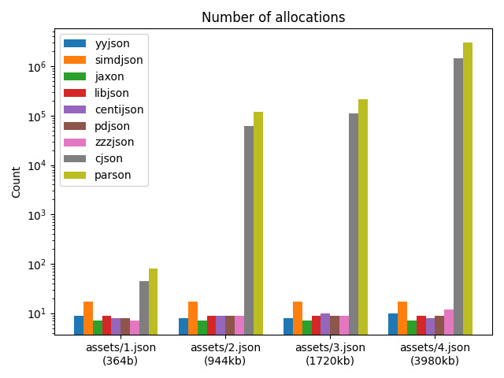

#

## Setup + Build

(Only tested with macOS)
Install submodules and then build:

    $ ./update_submodules.sh
    $ ./compile_tests.sh

Prerequisites for the image generation are `matplotlib` and `numpy`:

    $ brew install numpy matplotlib

## Run tests

    ./run_tests.py
    ./generate_images.sh

## Results

Tested on macOS M1 (arm64)

[parse](./reports/parse.json)
[traverse](./reports/traverse.json)
[memory](./reports/memory.json)
[allocations](./reports/allocations.json)

# Links

* https://github.com/ibireme/yyjson
* https://github.com/DaveGamble/cJSON
* https://github.com/dacez/zzzjson
* https://github.com/kgabis/parson
* https://github.com/simdjson/simdjson
